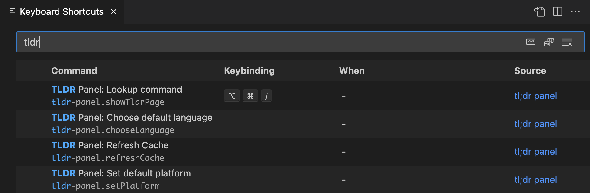

# tldr-panel

A utility for quick and easy command lookups directly in VSCode. Makes use of the excellent [tldr](https://github.com/tldr-pages/tldr/) pages:

> *a collection of community-maintained help pages for command-line tools, that aims to be a simpler, more approachable complement to traditional man pages.*

## Features

- Ability to search any command available in the **tldr documentation**
- Lightweight and fast, opens directly in vscode using the command palette
- Always up to date with the official tldr pages

## How to use this extension

Open your command palette using `ctrl/cmd+shift+p` and type `TLDR Panel: Lookup command`. Enter the command you would like to view docs for, and voilà! 🤌

Alternatively, you may toggle the command lookup using the keyboard with the default binding: `ctrl/cmd+alt+/`

This is configurable in the `TLDR Panel` keybindings section

## Extension Settings

This extension contributes the following settings:

- `tldr-panel.panelPosition`: Specify if the tldr page should be display in the active tab or a new tab. Supported values: `active | beside`
- `tldr-panel.cacheTimeoutMinutes`: Set the time value for how often the page index will be refreshed. Defaults to 30 days. (Note that command pages will always fetch the latest)
- `tldr-panel.defaultLanguage`: Specify language to prioritize when looking up commands. Will fallback to english if documentation is not found.
- `tldr-panel.defaultPlatform`: Specify platform to prioritize when looking up commands. Will use your current platform and fallback to \"common\" or the first available documentation if not available for your platform.

## Known Issues

None yet. Please file issues in the [Github Repo](https://github.com/felipemullen/tldr-panel/issues) or open up a pull request yourself!

## Release Notes

Please see the [change log](./docs/CHANGELOG.md)
